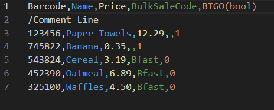
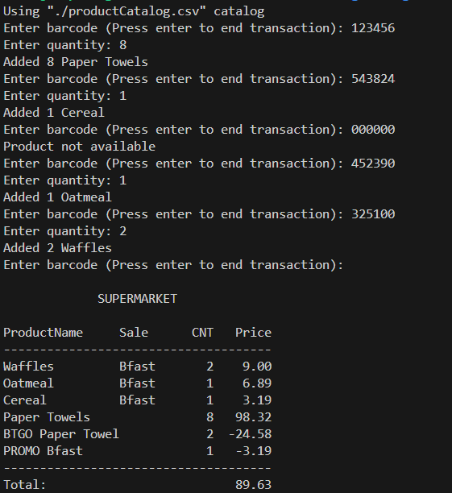

# Supermarket receipt program

Requires g++ and makefile

## Make commands
- "make test" runs test suite
- "make checkout" builds program
- "make clean" cleans build files

## Program Description
This program is concept of checking out store products by barcode.
The products are saved by barcode in the product catalog csv file. 
The products have a barcode, name, price, bulk deal code, and BTGO (buy two get
one free) flag. The bulk deal code puts products in a set where every third item is free.

